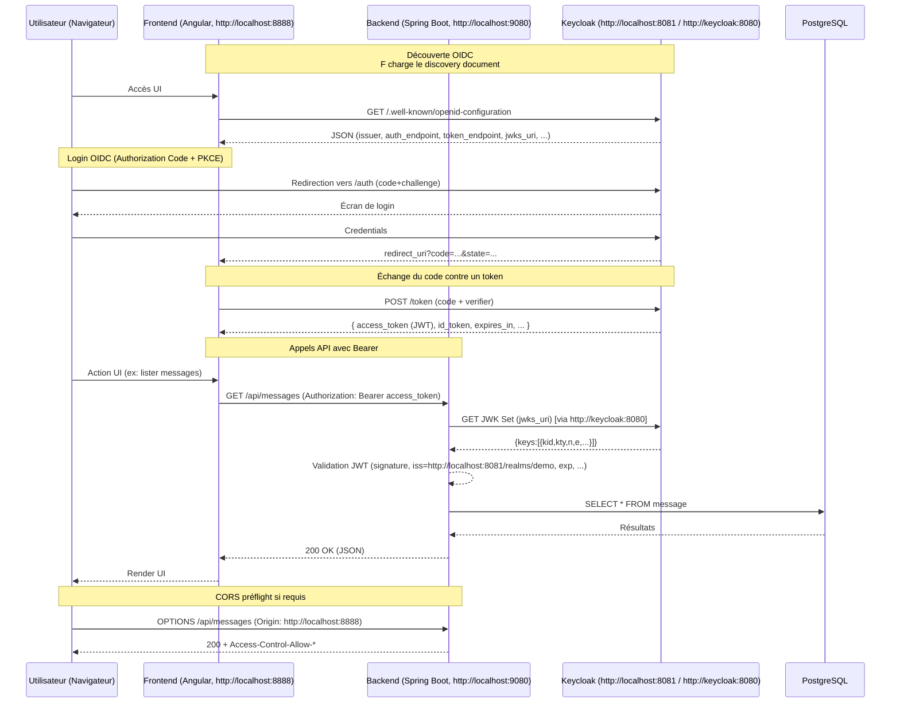

# Chat App — Stack complète (Angular + Spring Boot + PostgreSQL + Keycloak)

> Démarrage rapide avec `docker compose up --build`  
> Frontend : http://localhost:8888 • Backend : http://localhost:9080 • Keycloak : http://localhost:8081

## Sommaire
- [Chat App — Stack complète (Angular + Spring Boot + PostgreSQL + Keycloak)](#chat-app--stack-complète-angular--spring-boot--postgresql--keycloak)
  - [Sommaire](#sommaire)
  - [Vue d’ensemble](#vue-densemble)
  - [Architecture \& Services](#architecture--services)
  - [Sécurité (OIDC / JWT / CORS)](#sécurité-oidc--jwt--cors)
    - [Principe](#principe)
    - [Alignement `issuer` et JWK (important en Docker)](#alignement-issuer-et-jwk-important-en-docker)
    - [CORS](#cors)
  - [Variables d’environnement](#variables-denvironnement)
  - [Démarrage](#démarrage)
    - [Fichier `.env` minimal (optionnel)](#fichier-env-minimal-optionnel)
  - [Tests manuels (curl)](#tests-manuels-curl)
  - [Diagramme Mermaid détaillé](#diagramme-mermaid-détaillé)
  - [Dépannage](#dépannage)
  - [Documentation supplémentaire](#documentation-supplémentaire)
  - [Smoke tests (script)](#smoke-tests-script)
  - [Make (raccourcis)](#make-raccourcis)
    - [Générer un `.env`](#générer-un-env)
    - [Générer un `.env.dev` (développement)](#générer-un-envdev-développement)
    - [Commandes principales :](#commandes-principales)
    - [Développement local (hors Docker) :](#développement-local-hors-docker)
    - [Outils \& utilitaires :](#outils--utilitaires)
    - [Keycloak (import de realm prêt à l’emploi)](#keycloak-import-de-realm-prêt-à-lemploi)
  - [Troubleshooting](#troubleshooting)

## Vue d’ensemble
Application de démonstration **SPA Angular** (front) + **API Spring Boot** (back), sécurisée par **Keycloak (OIDC)**.  
La **base PostgreSQL** stocke les messages. La télémétrie est exposée à **Prometheus/Grafana**.

## Architecture & Services
- **frontend** (Angular + Nginx) : sert l’UI et émet des appels HTTP vers `backend`.
- **backend** (Spring Boot 3) : API REST (`/api/**`), Resource Server **JWT**.
- **keycloak** : serveur OIDC, gère identité & jetons.
- **db (PostgreSQL)** : stockage applicatif.
- **prometheus / grafana / cadvisor** : monitoring (optionnel).

## Sécurité (OIDC / JWT / CORS)
### Principe
- L’utilisateur s’authentifie via **OIDC Authorization Code + PKCE** auprès de **Keycloak**.
- Le **frontend** (SPA dans le navigateur) récupère un **access token (JWT)** et l’envoie en header `Authorization: Bearer …` vers le **backend**.
- Le **backend** valide le JWT (signature + `iss` + audience/exp) avec le **JWK Set URI** fourni par Keycloak.

### Alignement `issuer` et JWK (important en Docker)
- Le navigateur parle à Keycloak via **`http://localhost:8081`** → le JWT contient `iss = http://localhost:8081/realms/demo`.
- Le conteneur backend résout Keycloak via **`http://keycloak:8080`** (réseau Docker).  
  **Solution mise en place (Option A)** :
  - `OIDC_ISSUER_URI=http://localhost:8081/realms/demo`
  - `SPRING_SECURITY_OAUTH2_RESOURCESERVER_JWT_JWK_SET_URI=http://keycloak:8080/realms/demo/protocol/openid-connect/certs`

Ainsi **l’issuer** correspond bien au token du navigateur, tandis que **la découverte des clés** se fait côté réseau Docker.

### CORS
- Autorise les origines configurées par `CORS_ALLOWED_ORIGINS` (voir `docker-compose.yml`).  
- Les requêtes **préflight** (`OPTIONS`) sont **permises** côté backend.

## Variables d’environnement
Principales variables (voir `docker-compose.yml`) :

| Variable | Service | Rôle |
|---|---|---|
| `API_BASE_URL` | frontend | URL publique de l’API (injection runtime via Nginx) |
| `OIDC_ISSUER_URI` | backend | Issuer OIDC attendu par la validation JWT |
| `SPRING_SECURITY_OAUTH2_RESOURCESERVER_JWT_JWK_SET_URI` | backend | Emplacement du JWK Set (depuis le réseau Docker) |
| `CORS_ALLOWED_ORIGINS` | backend | Liste des origines autorisées (CORS) |
| `SPRING_DATASOURCE_*` | backend | Connexion PostgreSQL |
| `SERVER_PORT` | backend | Port interne Spring Boot (mappé à 9080 par Docker) |

## Démarrage
```bash
docker compose up --build
```

- Frontend : http://localhost:8888  
- Backend : http://localhost:9080  
- Keycloak : http://localhost:8081

### Fichier `.env` minimal (optionnel)
Vous pouvez créer un fichier `.env` (à la racine du projet) si vous souhaitez surcharger facilement certaines valeurs :
```env
OIDC_ISSUER_URI=http://localhost:8081/realms/demo
SPRING_SECURITY_OAUTH2_RESOURCESERVER_JWT_JWK_SET_URI=http://keycloak:8080/realms/demo/protocol/openid-connect/certs
CORS_ALLOWED_ORIGINS=http://localhost,http://localhost:8888
```

## Tests manuels (curl)
1) **Vérifier CORS / préflight** (depuis n’importe quel shell) :
```bash
curl -i -X OPTIONS http://localhost:9080/api/messages   -H 'Origin: http://localhost:8888'   -H 'Access-Control-Request-Method: GET'
```
Attendu : `HTTP/1.1 200 OK` et entêtes CORS.

2) **Appeler l’API avec un JWT** : récupérez d’abord un token via l’appli front (onglet réseau), puis :
```bash
export TOKEN='eyJhbGciOiJSUzI1NiIsInR5cCI...'   # votre access_token
curl -i http://localhost:9080/api/messages   -H "Authorization: Bearer $TOKEN"
```

## Diagramme Mermaid détaillé
> **Flux complet OIDC (Authorization Code + PKCE) + appels API JWT + CORS**



## Dépannage
- **401 Unauthorized** :  
  - Le header `Authorization` est absent côté front → vérifier `AuthInterceptor` et session OIDC.  
  - Claim `iss` différente de `OIDC_ISSUER_URI` → corriger `OIDC_ISSUER_URI`.  
  - Backend ne peut pas joindre le JWK → vérifier `SPRING_SECURITY_OAUTH2_RESOURCESERVER_JWT_JWK_SET_URI` (URL côté réseau Docker).
- **CORS bloqué** :  
  - Vérifier `CORS_ALLOWED_ORIGINS` et que `OPTIONS /**` est bien `permitAll()`.
- **Actuator health** : http://localhost:9080/actuator/health (ouvert sans auth).

---

## Documentation supplémentaire
- [OIDC — Séquence détaillée](docs/oidc-sequence.md)
- [PKCE — State Machine](docs/pkce-state-machine.md)
- [Topologie réseau Docker/Host](docs/network-topology.md)
- [Sécurité — Cheatsheet](docs/security-cheatsheet.md)

- [Troubleshooting](docs/troubleshooting.md)

## Smoke tests (script)
Un script de **tests rapides** est fourni :
```bash
TOKEN=$(./scripts/get-access-token.sh)   # génère un access token
```

```bash
./scripts/smoke-tests.sh                   # utilise $TOKEN si défini
TOKEN=eyJ... ./scripts/smoke-tests.sh      # passe le token inline
./scripts/smoke-tests.sh --token eyJ...    # passe le token en argument
```

Options : `--host`, `--api`, `--front`, `--kc` pour personnaliser les ports/host.

## Make (raccourcis)

### Générer un `.env`
```bash
make env   # crée/écrase .env avec des valeurs par défaut (profils Spring inclus)
```


### Générer un `.env.dev` (développement)
```bash
make env-dev   # crée .env.dev (ne remplace pas .env)
# Pour l'utiliser avec docker compose:
#   docker compose --env-file .env.dev up --build
# ou configurez votre outil/IDE pour utiliser .env.dev
```


### Commandes principales :

```bash
make up            # démarre tout (build si nécessaire)
make down          # arrête et supprime
make logs          # logs de tous les services
make smoke TOKEN=eyJ...   # lance les smoke tests avec un access token
make restart       # restart complet
make ps            # statut des services
```

### Développement local (hors Docker) :

```bash
make backend-test        # tests unitaires backend
make backend-it          # tests d'intégration (profile it)
make backend-dev-run     # lance le backend (profil dev)
make frontend-install    # npm ci
make frontend-build      # build prod frontend
make frontend-serve      # dev server Angular
```

### Outils & utilitaires :

```bash
make keycloak-restart    # restart du service Keycloak
make keycloak-admin      # affiche l'URL de console Admin
make clean               # nettoyage dist/ et target/
make prune               # prune docker (dangling)
```

### Keycloak (import de realm prêt à l’emploi)
Un export **realm** est fourni : `keycloak/realm-demo-with-client.json`.  
Il est importé automatiquement au démarrage grâce au volume et au paramètre `--import-realm`.

## Troubleshooting

Tester la santé du server :
```bash
curl -i http://localhost:9080/actuator/health
```

Tester l'appel d'une api :
```bash
TOKEN=$(./scripts/get-access-token.sh)   # DEV uniquement
curl -i http://localhost:9080/api/messages -H "Authorization: Bearer $TOKEN"
```

