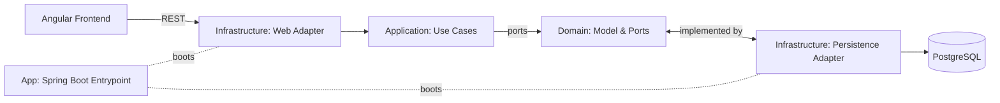

# 📨 Chat Messages – Fullstack Angular + Spring Boot

Une application de démonstration **fullstack** avec :

- **Frontend** : Angular 18 (standalone components, HttpClient)
- **Backend** : Java 21, Spring Boot 3.3.x, architecture hexagonale, multi-modules Maven
- **Database** : PostgreSQL + Flyway
- **Infrastructure** : Docker & Docker Compose

---

## 🚀 Fonctionnalités

- Interface Angular simple :
  - Saisir un message → envoyer vers le backend
  - Afficher la liste de tous les messages
- Backend REST :
  - `POST /api/messages` : persiste un message en base
  - `GET /api/messages` : récupère la liste des messages
- Persistance :
  - PostgreSQL
  - Migrations Flyway automatiques
- Déploiement **100% containerisé**

---

## 🏗️ Architecture

```
[Angular Frontend] -- REST --> [Spring Boot Backend] -- JPA --> [PostgreSQL]

Backend (Maven multi-modules, hexagonal):
  domain         : entités & ports (interfaces)
  application    : use cases
  infrastructure : adapters (web, persistence)
  app            : bootstrap Spring Boot
```

### Diagramme (Mermaid)



---

## 🐳 Démarrage rapide avec Docker Compose

### 1. Prérequis
- [Docker](https://docs.docker.com/get-docker/)
- [Docker Compose](https://docs.docker.com/compose/)

### 2. Lancer l’environnement
```bash
docker compose up --build
```

### 3. Accéder aux services
- Frontend (Angular + Nginx) → [http://localhost:8888](http://localhost:8888)
- Backend (Spring Boot REST API) → [http://localhost:9080/api/messages](http://localhost:9080/api/messages)
- PostgreSQL → `localhost:5432`, user/password: `chat/chat`

---

## 🔧 Développement local

### Backend
```bash
cd backend
mvn clean install
mvn -pl app spring-boot:run -Pdev
```

API accessible sur [http://localhost:9080/api/messages](http://localhost:9080/api/messages).

### Frontend
```bash
cd frontend
npm install
npm start
```

App accessible sur [http://localhost:8888](http://localhost:8888).

### Base

```bash
docker compose exec -it db psql -U chat -d chat
select * from messages;
```

---

## ⚙️ Configuration

### Variables d’environnement backend
- `SPRING_DATASOURCE_URL` : JDBC URL (par défaut `jdbc:postgresql://db:5432/chat`)
- `SPRING_DATASOURCE_USERNAME` : nom d’utilisateur Postgres
- `SPRING_DATASOURCE_PASSWORD` : mot de passe Postgres
- `CORS_ALLOWED_ORIGINS` : liste d’origines autorisées (ex: `http://localhost:8888,http://127.0.0.1:8888`)

### Fichiers Spring Boot
- `application-dev.yml` → profil dev
- `application-prod.yml` → profil prod

---

## 📂 Structure du projet

```
backend/
 ├── domain/           # Entités + ports
 ├── application/      # Use cases
 ├── infrastructure/   # Adapters (REST, JPA, config)
 └── app/              # Spring Boot entrypoint
frontend/
 ├── src/              # Angular sources
 ├── angular.json
 └── Dockerfile
docker-compose.yml
```

---

## Dépannage

- **Vérifier une variable**  
  → Vérifier la valeur d'une variable au sein d'un container qui s'exécute (runtime) :
    ```bash
    docker exec -it chat_frontend env | grep API_BASE_URL
    ```

- **Tester le CORS**  
  → Vérifier si l'url d'invocation des api est possible depuis une autre origine :  
  ```bash
  curl -i -X OPTIONS \
    -H "Origin: http://localhost:8888" \
    -H "Access-Control-Request-Method: GET" \
    http://localhost:9080/api/messages

  HTTP/1.1 200
  X-Correlation-Id: da84544b-4b94-4c4b-a2fc-c7236e7d201a
  Vary: Origin
  Vary: Access-Control-Request-Method
  Vary: Access-Control-Request-Headers
  Access-Control-Allow-Origin: http://localhost:8888
  Access-Control-Allow-Methods: GET,POST,PUT,DELETE,OPTIONS,PATCH
  Access-Control-Allow-Credentials: true
  Access-Control-Max-Age: 3600
  Content-Length: 0
  Date: Fri, 26 Sep 2025 15:27:34 GMT
  ```  
  On doit voir des en-têtes `Access-Control-Allow-*` dans la réponse.

- **Git**
  → Créer un tag  
  ```bash
  git tag -a v1.1 -m "version  v1.1 avec les tests"
  git push origin tag v1.1
  ```

---

## ✅ TODO / Améliorations possibles

- Authentification & gestion d’utilisateurs
- Tests end-to-end (Cypress / Playwright)
- CI/CD (GitHub Actions)

---

## 📜 Licence

Projet open-source sous licence MIT.
