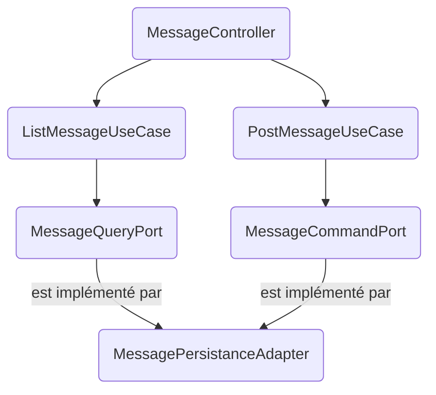

# Backend Maven Modules Overview

The backend is organized as a **multi-module Maven project** following a **hexagonal architecture**. Each module has a clear responsibility and explicit dependencies to enforce separation of concerns.

---

## Parent Module: `backend/pom.xml`

- **Packaging**: `pom`
- Defines common properties, dependency management (Spring Boot BOM), and shared build plugins.
- Aggregates all submodules:
  - `domain`
  - `application`
  - `infrastructure`
  - `app`

---

## Module: `domain`

- **ArtifactId**: `domain`
- **Dependencies**: Only Spring core/context.
- **Responsibilities**:
  - Contains the **core business model** (`Message` entity as immutable value object).
  - Declares **ports** (interfaces) for persistence and query operations.
  - No Spring Boot dependencies (pure Java domain).

---

## Module: `application`

- **ArtifactId**: `application`
- **Dependencies**: `domain`
- **Responsibilities**:
  - Implements **use cases** of the system (e.g. `PostMessageUseCase`, `ListMessagesUseCase`).
  - Depends only on domain ports, not on infrastructure.
  - Annotated with Spring `@Service` to integrate with Spring context.

---

## Module: `infrastructure`

- **ArtifactId**: `infrastructure`
- **Dependencies**: `application`
- **Responsibilities**:
  - Implements the **adapters** for external systems:
    - **Persistence Adapter**: JPA + PostgreSQL implementation of domain ports.
    - **Web Adapter**: REST controllers exposing the APIs.
    - **Configuration**: CORS, Jackson, Spring Data JPA.
  - Depends on Spring Boot starters (`web`, `data-jpa`), Flyway, and PostgreSQL driver.

---

## Module: `app`

- **ArtifactId**: `app`
- **Dependencies**: `infrastructure`
- **Responsibilities**:
  - The **entrypoint** of the application (`ChatApplication`).
  - Contains the Spring Boot bootstrap configuration.
  - Holds **Flyway migrations** for PostgreSQL schema evolution.
  - Produces the runnable **Spring Boot fat jar** (via `spring-boot-maven-plugin`).

---

## Build & Run

### Profils

- **Dev**  
  → constuire le projet (schéma auto-géré, logs verbeux, DB locale)
  → tests unitaires (sans IHM), en mockant avec H2.  
  → tests avec l'IHM.  

- **IT**  
  → tests d'intégration (sans IHM), en utilisant un container PostgreSQL temporaire.  

- **Prod**  
  → constuire le projet pour docker compose (schéma validé par Flyway, logs sobres, DB Docker/Postgres en cluster)


### Dev

```bash
# Build && TU (H2)
mvn clean install -Pdev

# Run && IHM
SERVER_PORT=9080 mvn -pl app spring-boot:run -Pdev.    # ici : surcharge du port 8080 (utilisé par docker) par 9080
http://localhost:8888
```
Le `-pl app` permet d'indiquer à maven de n'exécuter le `spring-boot:run` que sur le module **app**, sinon il serait lancé sur tous les modules.

### IT

```bash
# Build && TU (H2) && TI (Testcontainers PostgreSQL)
mvn clean verify -Pit
```

### Prod

```bash
# Build pour la Prod
mvn clean install -Pprod
```

---

## Dependency Flow

```
[domain] <- [application] <- [infrastructure] <- [app]
```

- **Domain**: independent of all other modules.
- **Application**: depends only on domain.
- **Infrastructure**: depends on application.
- **App**: depends on infrastructure.

This ensures the **hexagonal architecture**: domain and use cases are at the core, while adapters (infrastructure, web, persistence) are at the edges.

---

## Visual Architecture Diagram (Mermaid)



---

## Dépannage

- **Erreur Flyway (migrations déjà appliquées)**  
  → Vérifier la table `flyway_schema_history` dans la base, ajuster la version ou nettoyer la base.

- **Erreur JPA `relation messages does not exist`**  
  → Vérifier que Flyway a bien créé la table `messages` (migration exécutée au démarrage).

- **Problème de connexion PostgreSQL**  
  → Vérifier l’URL, l’utilisateur/mot de passe dans `application.yml`, et que le service `db` est bien démarré.

- **Port déjà utilisé (8080 ou 5432)**  
  → Modifier `SERVER_PORT` (backend) ou `ports` dans `docker-compose.yml`.

- **Erreur de dépendance Maven manquante**  
  → Lancer `mvn clean install -U` pour forcer la mise à jour des dépendances locales.

### Conseils d’utilisation

- En Docker/compose, passe les variables `SPRING_DATASOURCE_*` et `SERVER_PORT` via `environment:` (déjà prévu dans `docker-compose.yml`).
- En prod, pense à définir un pool Hikari adapté (`spring.datasource.hikari.*`).
- Pour testser si un port est déjà occupé sur Mac : `lsof -i :8080`
- Tester le contenu de la base de données PostgreSQL (en mode docker compose) :
  ```bash
  docker compose exec -it db psql -U chat -d chat
  select * from messages;
  ```