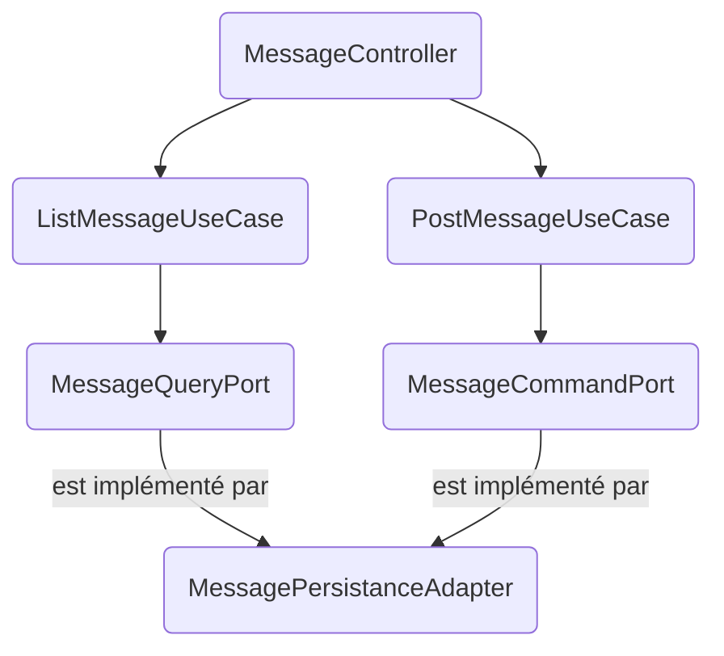

# Backend Maven Modules Overview

The backend is organized as a **multi-module Maven project** following a **hexagonal architecture**. Each module has a clear responsibility and explicit dependencies to enforce separation of concerns.

---

## Parent Module: `backend/pom.xml`

- **Packaging**: `pom`
- Defines common properties, dependency management (Spring Boot BOM), and shared build plugins.
- Aggregates all submodules:
  - `domain`
  - `application`
  - `infrastructure`
  - `app`

---

## Module: `domain`

- **ArtifactId**: `domain`
- **Dependencies**: Only Spring core/context.
- **Responsibilities**:
  - Contains the **core business model** (`Message` entity as immutable value object).
  - Declares **ports** (interfaces) for persistence and query operations.
  - No Spring Boot dependencies (pure Java domain).

---

## Module: `application`

- **ArtifactId**: `application`
- **Dependencies**: `domain`
- **Responsibilities**:
  - Implements **use cases** of the system (e.g. `PostMessageUseCase`, `ListMessagesUseCase`).
  - Depends only on domain ports, not on infrastructure.
  - Annotated with Spring `@Service` to integrate with Spring context.

---

## Module: `infrastructure`

- **ArtifactId**: `infrastructure`
- **Dependencies**: `application`
- **Responsibilities**:
  - Implements the **adapters** for external systems:
    - **Persistence Adapter**: JPA + PostgreSQL implementation of domain ports.
    - **Web Adapter**: REST controllers exposing the APIs.
    - **Configuration**: CORS, Jackson, Spring Data JPA.
  - Depends on Spring Boot starters (`web`, `data-jpa`), Flyway, and PostgreSQL driver.

---

## Module: `app`

- **ArtifactId**: `app`
- **Dependencies**: `infrastructure`
- **Responsibilities**:
  - The **entrypoint** of the application (`ChatApplication`).
  - Contains the Spring Boot bootstrap configuration.
  - Holds **Flyway migrations** for PostgreSQL schema evolution.
  - Produces the runnable **Spring Boot fat jar** (via `spring-boot-maven-plugin`).

---

## Build & Run

From the `backend/` folder:

```bash
# Build all modules
mvn clean install

# Run locally (with default Postgres on localhost)
mvn -pl app spring-boot:run

# Or build the Docker image
docker build -t chat-backend ./backend
```

---

## Dependency Flow

```
[domain] <- [application] <- [infrastructure] <- [app]
```

- **Domain**: independent of all other modules.
- **Application**: depends only on domain.
- **Infrastructure**: depends on application.
- **App**: depends on infrastructure.

This ensures the **hexagonal architecture**: domain and use cases are at the core, while adapters (infrastructure, web, persistence) are at the edges.

---

## Visual Architecture Diagram (Mermaid)



---

## Build Pipeline Diagram (ASCII)

```
 mvn clean install (at backend/)
        │
        ├──> domain (jar)
        │
        ├──> application (jar)  ── depends on domain
        │
        ├──> infrastructure (jar) ─ depends on application
        │
        └──> app (boot jar)       ─ depends on infrastructure
                                   └─ produces runnable fat jar
```

---

## Commandes utiles Maven

- **Construire tout le backend** :
  ```bash
  mvn clean install
  ```
- **Exécuter uniquement le module app** :
  ```bash
  mvn -pl app spring-boot:run
  ```
- **Compiler et packager sans tests** :
  ```bash
  mvn clean package -DskipTests
  ```
- **Rebuilder un module et ses dépendances** :
  ```bash
  mvn -pl infrastructure -am install
  ```
- **Lancer avec un profil spécifique** :
  ```bash
  mvn -pl app spring-boot:run -Pdev
  ```

---

## Dépannage

- **Erreur Flyway (migrations déjà appliquées)**  
  → Vérifier la table `flyway_schema_history` dans la base, ajuster la version ou nettoyer la base.

- **Erreur JPA `relation messages does not exist`**  
  → Vérifier que Flyway a bien créé la table `messages` (migration exécutée au démarrage).

- **Problème de connexion PostgreSQL**  
  → Vérifier l’URL, l’utilisateur/mot de passe dans `application.yml`, et que le service `db` est bien démarré.

- **Port déjà utilisé (8080 ou 5432)**  
  → Modifier `SERVER_PORT` (backend) ou `ports` dans `docker-compose.yml`.

- **Erreur de dépendance Maven manquante**  
  → Lancer `mvn clean install -U` pour forcer la mise à jour des dépendances locales.

---

## Exemple de profils Maven (`app/pom.xml`)

On peut définir plusieurs profils pour gérer des environnements différents (développement vs production).

```xml
<project>
  ...
  <profiles>
    <profile>
      <id>dev</id>
      <properties>
        <spring.profiles.active>dev</spring.profiles.active>
        <skipTests>false</skipTests>
      </properties>
    </profile>

    <profile>
      <id>prod</id>
      <properties>
        <spring.profiles.active>prod</spring.profiles.active>
        <skipTests>true</skipTests>
      </properties>
    </profile>
  </profiles>
</project>
```

### Utilisation

- **Démarrer avec profil dev** :
  ```bash
  mvn -pl app spring-boot:run -Pdev
  ```
- **Packager pour la prod** :
  ```bash
  mvn clean package -Pprod
  ```

---

## Exemple de configuration Spring Boot par environnement

Dans le module `app/src/main/resources`, on peut définir plusieurs fichiers de configuration :

### `application-dev.yml`

```yaml
spring:
  datasource:
    url: jdbc:postgresql://localhost:5432/chat
    username: chat
    password: chat
  jpa:
    hibernate:
      ddl-auto: update
    show-sql: true
server:
  port: 8080
logging:
  level:
    root: DEBUG
```

### `application-prod.yml`

```yaml
spring:
  datasource:
    url: jdbc:postgresql://db:5432/chat
    username: chat
    password: chat
  jpa:
    hibernate:
      ddl-auto: validate
  flyway:
    enabled: true
server:
  port: 8080
logging:
  level:
    root: INFO
```

### Comment les utiliser ?

- Lorsqu’on lance Maven avec `-Pdev`, le profil `spring.profiles.active=dev` est appliqué, donc `application-dev.yml` est chargé.
- Avec `-Pprod`, c’est `application-prod.yml` qui est utilisé.

Cela permet d’avoir :

- **Dev** : schéma auto-géré, logs verbeux, DB locale.
- **Prod** : schéma validé par Flyway, logs sobres, DB Docker/Postgres en cluster.

---

## Exemples `application-dev.yml` et `application-prod.yml`

Place ces fichiers dans `backend/app/src/main/resources/`.

### `application-dev.yml`

```yaml
server:
  port: ${SERVER_PORT:8080}

spring:
  datasource:
    url: ${SPRING_DATASOURCE_URL:jdbc:postgresql://localhost:5432/chat}
    username: ${SPRING_DATASOURCE_USERNAME:chat}
    password: ${SPRING_DATASOURCE_PASSWORD:chat}
  jpa:
    hibernate:
      ddl-auto: validate
    properties:
      hibernate.format_sql: true
      hibernate.jdbc.time_zone: UTC
  flyway:
    enabled: true

logging:
  level:
    root: INFO
    org.springframework.web: DEBUG
    org.hibernate.SQL: DEBUG
    org.hibernate.type.descriptor.sql: TRACE

management:
  endpoints:
    web:
      exposure:
        include: health,info
```

### `application-prod.yml`

```yaml
server:
  port: ${SERVER_PORT:8080}
  compression:
    enabled: true
    mime-types: text/html,text/xml,text/plain,text/css,text/javascript,application/javascript,application/json

spring:
  datasource:
    url: ${SPRING_DATASOURCE_URL}
    username: ${SPRING_DATASOURCE_USERNAME}
    password: ${SPRING_DATASOURCE_PASSWORD}
  jpa:
    hibernate:
      ddl-auto: validate
    properties:
      hibernate.jdbc.time_zone: UTC
  flyway:
    enabled: true

logging:
  level:
    root: INFO

management:
  endpoints:
    web:
      exposure:
        include: health
  endpoint:
    health:
      show-details: when_authorized
```

### Conseils d’utilisation

- Active le profil voulu via Maven (ex. **dev**) :
  ```bash
  mvn -pl app spring-boot:run -Pdev
  ```
- En Docker/compose, passe les variables `SPRING_DATASOURCE_*` et `SERVER_PORT` via `environment:` (déjà prévu dans `docker-compose.yml`).
- En prod, pense à définir un pool Hikari adapté (`spring.datasource.hikari.*`).

## Test Database
```bash
docker compose exec -it db psql -U chat -d chat
select * from messages;
```