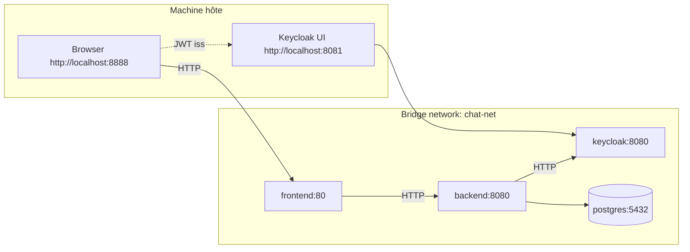

# Topologie réseau — Host vs Réseau Docker

**Points clés :**
- Le navigateur voit **Keycloak via `http://localhost:8081`** → le JWT a `iss=http://localhost:8081/realms/demo`.
- Le backend résout Keycloak via **`http://keycloak:8080`** (nom de service Docker) pour le **JWK Set**.
- C’est pourquoi on utilise **`OIDC_ISSUER_URI`** (côté browser) et un **`SPRING_SECURITY_OAUTH2_RESOURCESERVER_JWT_JWK_SET_URI`** (côté Docker) distincts.
