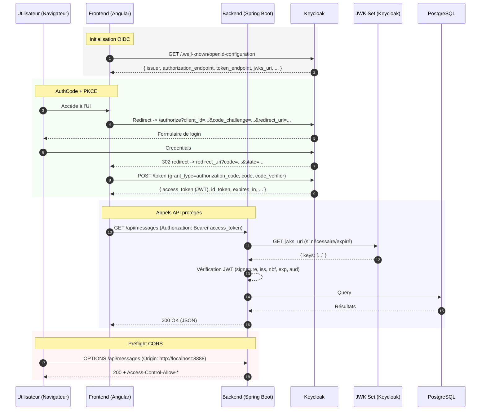

# OIDC — Séquence détaillée (Authorization Code + PKCE)

```mermaid
sequenceDiagram
    autonumber
    participant U as Utilisateur (Navigateur)
    participant F as Frontend (Angular)
    participant B as Backend (Spring Boot)
    participant K as Keycloak
    participant JWKS as JWK Set (Keycloak)
    participant DB as PostgreSQL

    rect rgb(245,245,245)
    Note over F: Initialisation OIDC
    F->>K: GET /.well-known/openid-configuration
    K-->>F: { issuer, authorization_endpoint, token_endpoint, jwks_uri, ... }
    end

    rect rgb(245,255,245)
    Note over U,F: AuthCode + PKCE
    U->>F: Accède à l'UI
    F->>K: Redirect -> /authorize?client_id=...&code_challenge=...&redirect_uri=...
    K-->>U: Formulaire de login
    U->>K: Credentials
    K-->>F: 302 redirect -> redirect_uri?code=...&state=...
    F->>K: POST /token (grant_type=authorization_code, code, code_verifier)
    K-->>F: { access_token (JWT), id_token, expires_in, ... }
    end

    rect rgb(245,245,255)
    Note over F,B: Appels API protégés
    F->>B: GET /api/messages (Authorization: Bearer access_token)
    B->>JWKS: GET jwks_uri (si nécessaire/expiré)
    JWKS-->>B: { keys: [...] }
    B-->>B: Vérification JWT (signature, iss, nbf, exp, aud)
    B->>DB: Query
    DB-->>B: Résultats
    B-->>F: 200 OK (JSON)
    end

    rect rgb(255,245,245)
    Note over U,B: Préflight CORS
    U->>B: OPTIONS /api/messages (Origin: http://localhost:8888)
    B-->>U: 200 + Access-Control-Allow-*
    end
```
