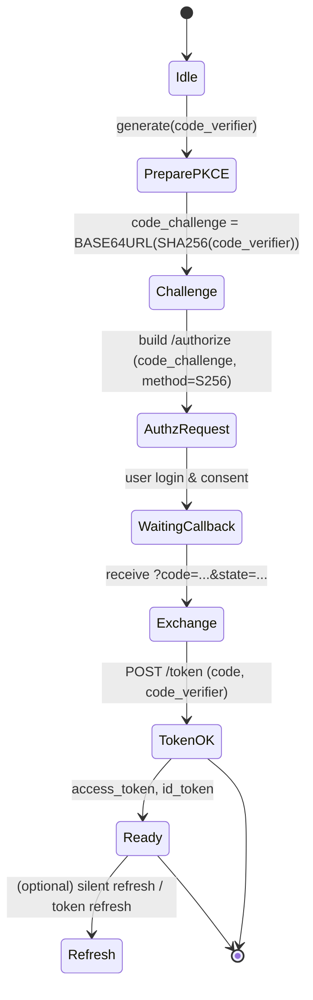

# PKCE — State Machine (client public)

```mermaid
stateDiagram-v2
    [*] --> Idle

    Idle --> PreparePKCE: generate(code_verifier)
    PreparePKCE --> Challenge: code_challenge = BASE64URL(SHA256(code_verifier))
    Challenge --> AuthzRequest: build /authorize (code_challenge, method=S256)
    AuthzRequest --> WaitingCallback: user login & consent
    WaitingCallback --> Exchange: receive ?code=...&state=...
    Exchange --> TokenOK: POST /token (code, code_verifier)
    TokenOK --> Ready: access_token, id_token
    Ready --> Refresh: (optional) silent refresh / token refresh

    TokenOK --> [*]
    Ready --> [*]
```
